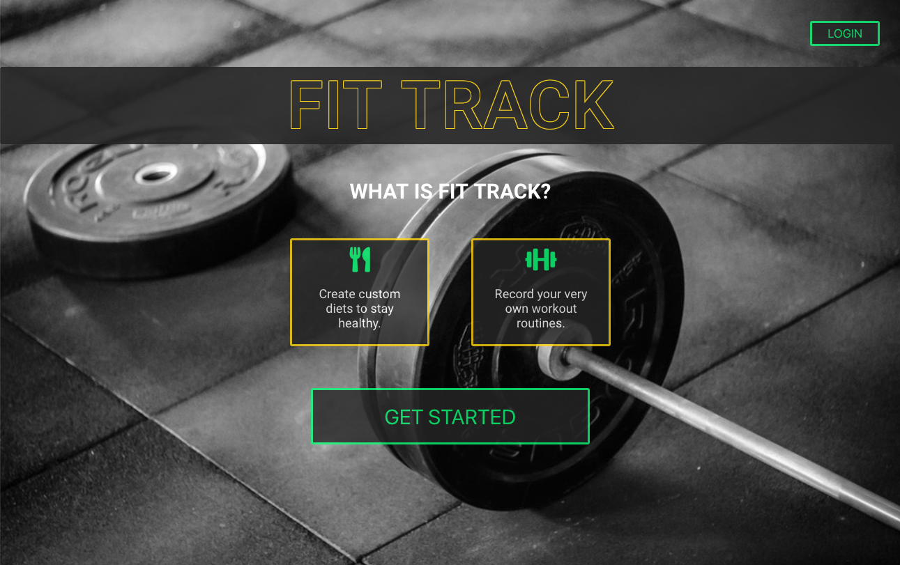
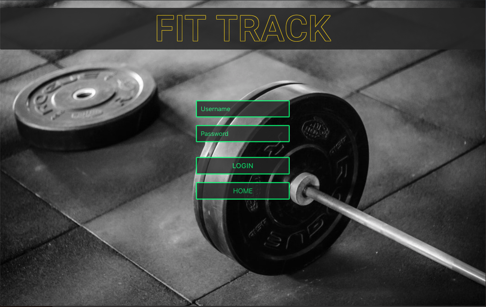
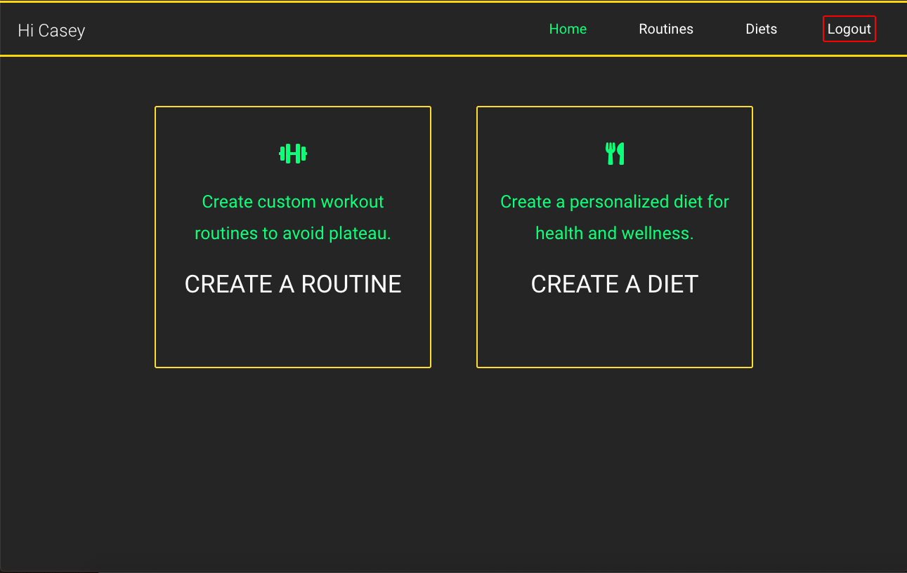
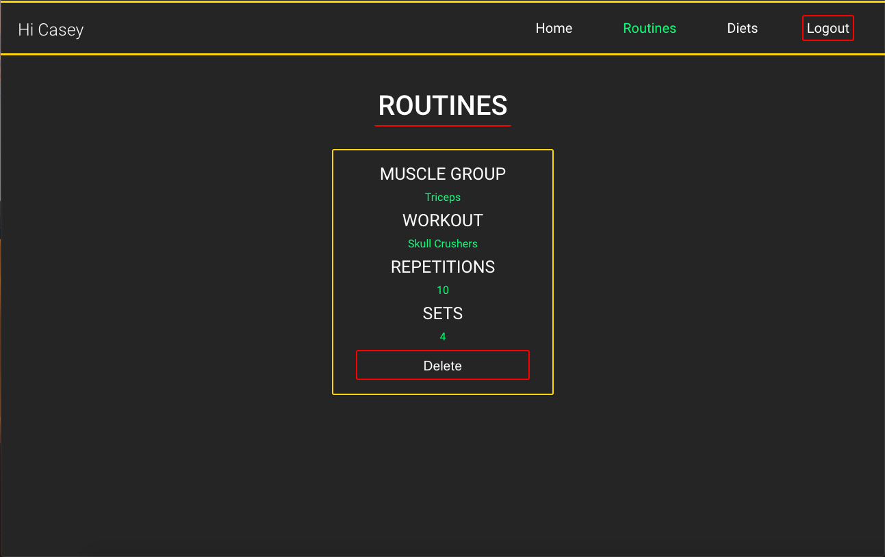
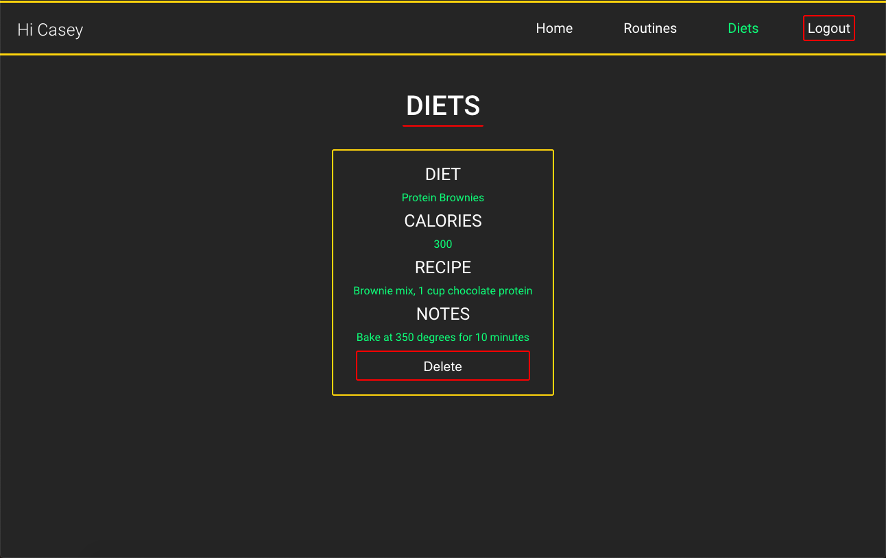
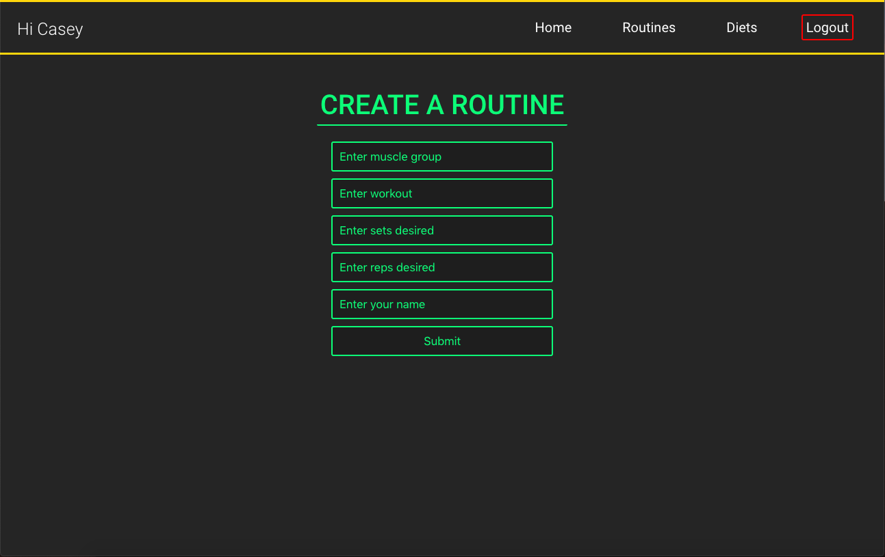
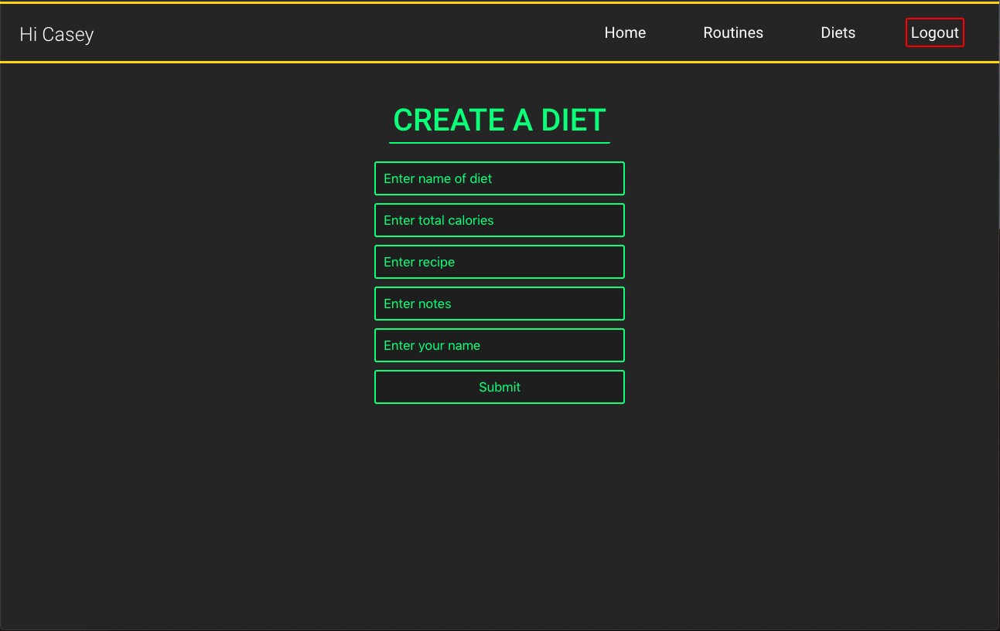

# Fit-Track

[link to live app](https://polar-beyond-41706.herokuapp.com/index.html)

Demo account:

**Username**: Demo
 
**Password**: demo123

Welcome to my fitness tracking app where you can keep track of and personalize workout routines, organize and store favorite meal options.  Create a username and password and get started today!

<h2>Screenshots</h2>

Landing Page

Login page

Profile page

Created Routines

Created Diets

Create a Routine

Create a Diet

# Technologies Used
HTML5, CSS, Node, Express, jQuery, JavaScript, MongoDB, Mongoose, JWT, Passport, Mocha, Chai, REST APIs

